## **Connecting Microsoft Power BI Service to Oracle Autonomous Database using Microsoft Gateway**


This step by step guide shows you how to configure Microsoft Power BI cloud service connectivity to Oracle Autonomous Database (ADB) using Microsoft Data Gateway.  Power BI apps are developed on Power BI Desktop and the app is deployed to the Power BI service.  


These instructions use managed or unmanaged Oracle Data Provider for .NET (ODP.NET) for data access and work for both dedicated and shared infrastructure ADB.

## **Prerequisites**

This document assumes ADB, such as Autonomous Data Warehouse (ADW) or Autonomous Transaction Processing (ATP), or Autonomous JSON Database (AJD) is provisioned on OCI.  


## **Install and Setup** 

1. Create Power BI Service in Azure.

   https://powerbi.microsoft.com/en-us/landing/signin


2. Create a Windows instance for the Microsoft Data Gateway.  In this case, a Windows server is created in the Oracle Cloud Infrastructure (OCI).


3. Install Microsoft Data Gateway on the Windows instance with these steps:
   1. Connect to the Power BI Service
   2. Select Data Gateway
   3. Download the software to install
   4. Install on the Windows instance
   5. Register the Data Gateway
   6. Sign in to the Data Gateway


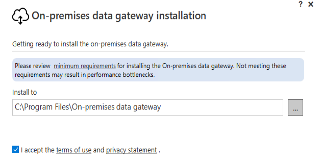

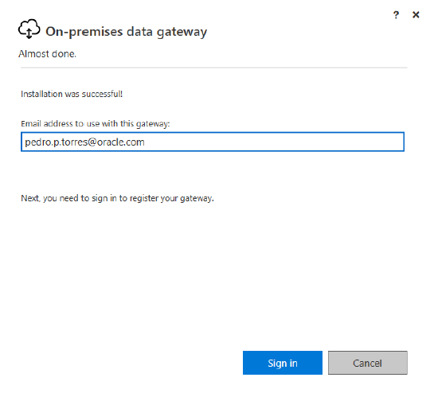


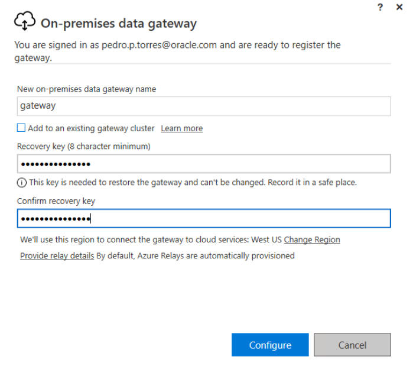


## **Install the Oracle Client**

6. Download Oracle Client 19c on the Windows instance running the Data Gatway.

https://www.oracle.com/database/technologies/oracle19c-windows-downloads.html


7. Install on the Windows instance.

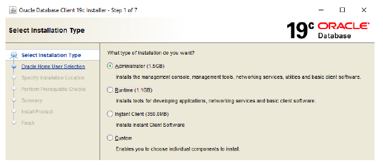


## **Configuring ODP.NET**

This tutorial was tested with unmanaged ODP.NET for Oracle database connectivity. 

8. Download 64-bit ODAC 19.3 from the ODAC Xcopy section in the middle of this [Oracle web page](https://www.oracle.com/database/technologies/dotnet-odacdeploy-downloads.html). 

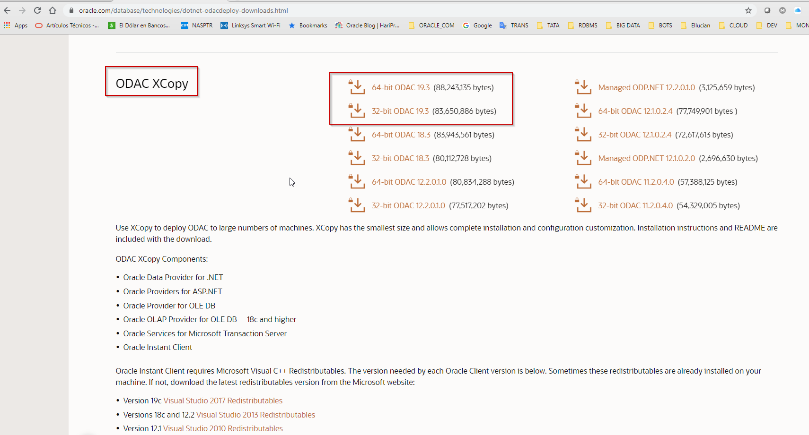


9. Now, we’ll install ODP.NET.  Unzip the download contents to a staging directory (e.g. c:\xcopy64-install).


10. Open a Windows command prompt **in administrator mode.** Navigate to the staging directory, then execute the next command to install ODP.NET:

​     install.bat odp.net4 `<installation directory>` odp64


Note: Enter the installation location (e.g. c:\odp64) for the directory parameter.

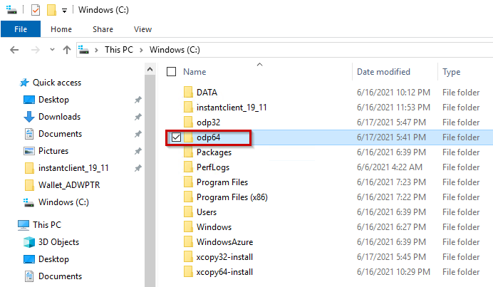


11. In the command prompt in **administrator mode**, navigate to the installation subdirectory, `<installation directory>`\odp.net\bin\4. Then, execute the following commands:

a.    To configure unmanaged ODP.NET:

`OraProvCfg /action:gac /providerpath:"Oracle.DataAccess.dll"`


`OraProvCfg /action:config /product:odp /frameworkversion:v4.0.30319 /providerpath:"Oracle.DataAccess.dll"`


Note: Validate that you are using the correct path for Oracle.DataAccess.dll file.

12. Edit the Windows environment variables by adding the path value of the 64-bit Oracle Client directory (e.g. c:\odp64).
13. In the User variables create the TNS_ADMIN variable.  Set its value to the directory location where you will unzip the ADB wallet contents.

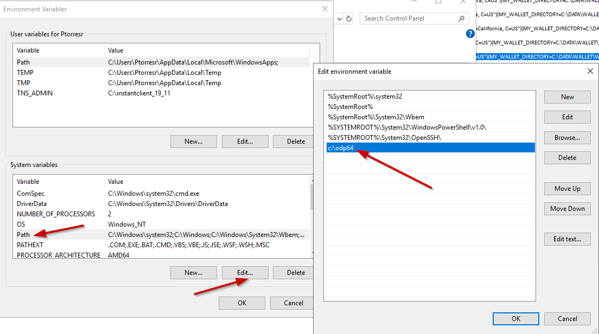


To ensure this directory path setting has precedence over existing Oracle Homes, move the setting up to the highest possible level in the directory order with the “Move Up” button.

14. Enable the Data Gateway in the Power BI Service by selecting the "Manage Gateways" menu.


15. Add the Data Gateway and provide a name.


16. Add the data source from your tnsnames and your database credentials.

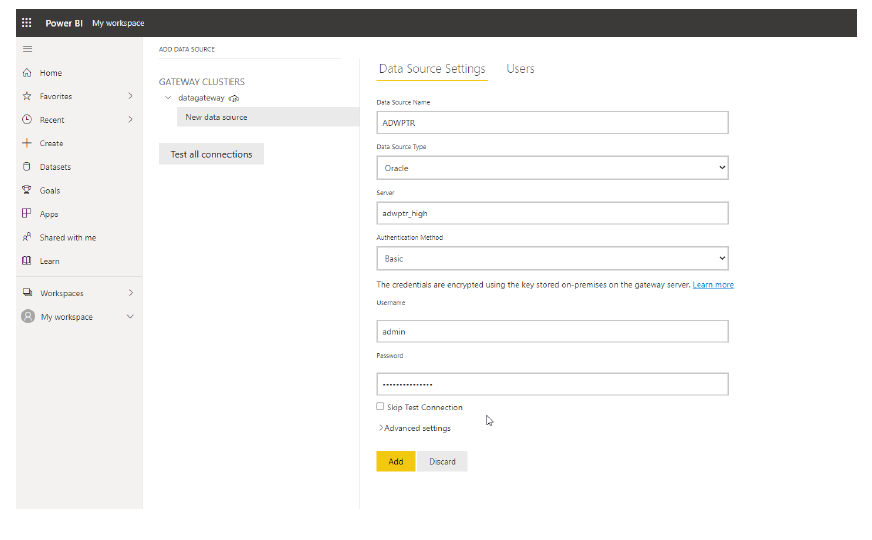

17. Validate the connection.


18. Connect to the Power BI Service and create a Workspace.

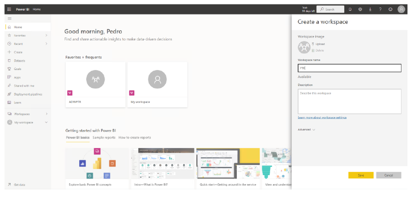

18. Add a new Data Flow from the menu and define "New Tables".


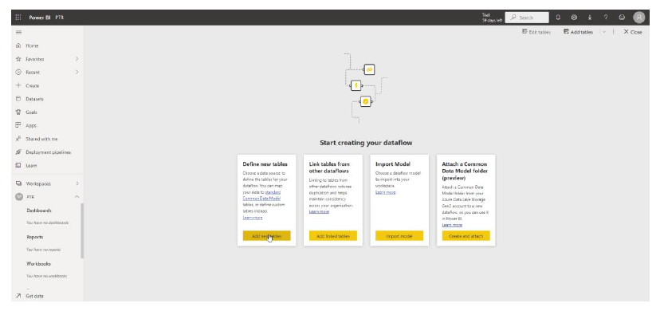

19. Select the Data Source "Oracle Database".

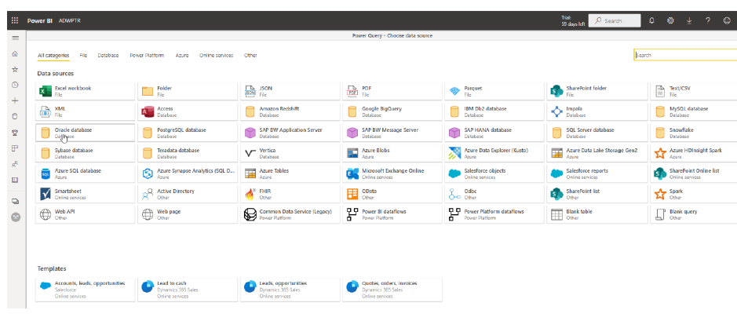

20. Enter the database connection information, then click Next.


Congratulations!  Your Power BI Service should now connect to ADB.  Open in Navigator the tables to create your own Power BI Service Document (.pbix) and load the data.

Select the tables that you want to use.


## **Troubleshooting**

Error: "Object reference not set to an instance of an object"

Check that you have added the environment variables properly.  ie: C:\odp64 or odp32

```
C:\WINDOWS\system32>echo %PATH%

C:\odp64;C:\Program Files (x86)\Common Files\Oracle\Java\javapath;C:\WINDOWS\system32;C:\WINDOWS;C:\WINDOWS\System32\...
```

Error: "Oracle: ORA-12154: TNS:could not resolve the connect identifier specified"

Check that you have added the user environment variables properly.  ie: TNS_ADMIN and path to tnsnames.ora and sqlnet.ora

```
C:\WINDOWS\system32>echo %TNS_ADMIN%

C:\<Oracle Home\network\admin
```

Note: A restart of the Windows OS or the Power BI application may be needed for the environment variables to take effect.

Check your sqlnet.ora is set to the directory of your wallet or you are setting the directory using the parameter `MY_WALLET_DIRECTORY` in tnsnames.ora.


## **Acknowledgements**
* **Author(s)** - Pedro Torres, Alex, Keh, Database Product Management
* **Contributor(s)** - Vijay Balebail, Milton Wan, Database Product Management
* **Last Updated By/Date** - Milton Wan, December 2021
